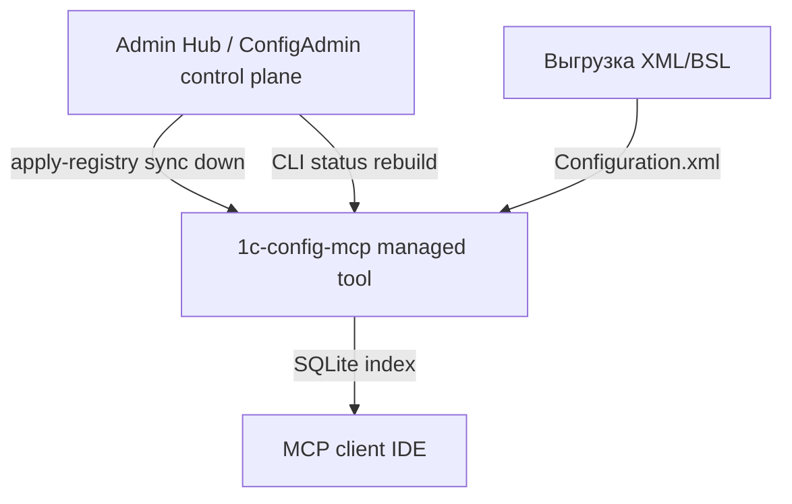

## Интеграция с Admin Hub (config-mcp)

### Статус

- **Протокол:** v1 + addendum v1.0.1 + v1.0.2 + v1.0.3 (при конфликте — приоритет у **v1.0.3**).
- **Phase 1 (read-only):** **реализован** — manifest example, `runtime_paths`, `hub_protocol`, CLI (`inventory`, `status`, `export-registry`), сборка `Tools/1c-config-cli.exe`.
- **Phase 2 (registry sync):** **реализован (core)** — `apply-registry`, `sourcePath`/`sourceKind`, UUID v4, atomic write; `operations.log` — backlog.
- **Phase 3 (headless rebuild):** **реализован** — `rebuild-index`, `rebuild-all`, `reconcile-markers`, `--trigger-rebuild`; `indexReadiness` в status.
- **Режим по умолчанию:** `standalone` portable; hub optional.

**CLI (dev):**

```bash
python -m admin_tool.cli --root /path/to/portable status --json
python -m admin_tool.cli --root /path/to/portable apply-registry --input fragment.json --json
python -m admin_tool.cli --root /path/to/portable rebuild-index --db-id <infobaseId> --json
```

**Переопределение root:** `--root` или env `CONFIG_MCP_ROOT`.

### Роль модуля в экосистеме



**1C Config MCP** — модуль типа `config-mcp`:

- индексирует выгрузку конфигурации в SQLite;
- отдаёт метаданные и код через MCP (read-only query plane);
- управляет реестром проектов/баз через `projects.json` и admin GUI.

Admin Hub владеет canonical registry (клиенты, выгрузки, связи); этот модуль материализует фрагмент в `projects.json` и выполняет headless-операции (rebuild, status).

### Согласованный mapping Hub ↔ config-mcp (2026-06-28)

**Статус:** agreed async (2026-06-28). Канонический mapping — [`docs/group/protocol-ref/epoch0/registry-mapping.md`](group/protocol-ref/epoch0/registry-mapping.md).

| Термин Hub | Термин config-mcp | Соотношение | Примечание |
|------------|-------------------|-------------|------------|
| **Client** | `projects[]` (элемент) | **1:1** (целевое) | `clientId` на project; `name` — для людей и `project_filter` в MCP |
| **Infobase** | нет отдельной сущности | 1:N | Одна инфобаза 1С → 1..N `databases[]` (base + extensions) |
| **ConfigurationExport** | `database` (`source_path`, `source_kind`) | **1:1** | Одна запись database на один export |
| **ConfigurationTemplate** | `database.type` + `name` | N:1 | Отдельная таблица в config-mcp не нужна |
| **Hub `projects`** (SQLite, v1.0.2 §10) | нет аналога | — | Внутренняя сущность Hub; в `projects.json` не материализуется |
| **Task** | нет | — | Вне scope config-mcp |

**Идентификаторы в fragment:**

- `projectId` — стабильный UUID на **Client** (`clients.config_mcp_project_id` в целевой модели Hub); upsert в `projects[].id`.
- `clientId` — **обязательно** в целевом fragment; reconcile portable по `clientId` без дубликатов.
- `infobaseId` — **database registry id** = `ConfigurationExport.id` в Hub; **не** `Infobase.id`. В локальном JSON: `databases[].id`. Один `rebuild-index` на один такой id.

**Целевой fragment:** один config-mcp project на Client, N `databases[]` (patch после каждого export). **R1** (ручной линк infobase→project, fragment 1:1:1) — переходный, не целевое поведение.

**Rename:** ключи `project` / `projects.json` в config-mcp **не меняем**; mapping фиксируется текстом в протоколе.

### Принципы разработки (обязательные)

1. **Minimum invasive unification** — переиспользовать `ProjectManager`, `DatabaseManager`, `db_build_state`; не переписывать парсер/MCP ради hub.
2. **Три слоя в модуле:** реестр (`projects.json`) → операции (`shared/hub_protocol`) → адаптеры (GUI, MCP server, CLI).
3. **GUI не центр интеграции** — hub вызывает CLI/subprocess, не tkinter.
4. **MCP остаётся query plane** — control-plane операции (rebuild, apply-registry) **не** добавлять в MCP tools.
5. **Portable layout не ломать** — root с `Admin/`, `Server/`, `Tools/`, `projects.json`, `databases/`.
6. **Manifest — source of truth для путей** — hub не угадывает layout; см. addendum §3.
7. **Standalone по умолчанию** — `mode: standalone` в manifest до явного перехода в managed.
8. **Protocol deviation** — отклонения от v1/addendum документировать явно (Deviation, Reason, Impact, Workaround).

### Текущее состояние vs протокол

| Компонент протокола | Статус |
|---------------------|--------|
| `module.manifest.json` | example в репо; копия в portable при `build_all.bat` |
| `Tools/1c-config-cli.exe` | сборка Phase 1 (`build_all.bat`) |
| `inventory --json` | **готово** (`shared/hub_protocol`, `admin_tool/cli`) |
| `status --json` | **готово** |
| `export-registry --json` | **готово** (v1.0.2: `sourcePath`/`sourceKind`) |
| `shared/runtime_paths.py` | **готово** |
| `apply-registry` | **готово** (patch default, atomic write, UUID v4) |
| `shared/cli_json.py` | **готово** (UTF-8 stdout/input, v1.0.3) |
| `shared/source_path.py` | **готово** |
| `rebuild-index` / `rebuild-all` / `reconcile-markers` | **готово** (`shared/hub_rebuild`, `admin_tool/cli`) |
| `operations.log` | backlog (Phase 2 ops) |

Portable root (после `build_all.bat`):

```text
1c_config_mcp_server_Portable/
  module.manifest.json
  projects.json
  databases/
  Admin/1C-Config-Admin.exe
  Server/1c-config-server.exe
  Tools/1c-config-cli.exe
```

### Ownership (config-mcp)

По addendum v1.0.1 §8.2 / §11.1; уточнения v1.0.2 §5 — **`sourcePath` + `sourceKind`** (см. ниже).

**Hub-owned (sync down → `projects.json`):**

- `projectId`, `clientId`, имя проекта, `active`
- `infobaseId`, имя базы, `type` (`base` | `extension`)
- `sourcePath`, `sourceKind` (`directory` | `archive`), `platformVersion`

**Локальная модель (Phase 2):** canonical `source_path` + `source_kind`; derived `source_xml` (resolved `Configuration.xml` для индексера); legacy записи с одним `source_xml` нормализуются при export/status (lazy read).

**Protocol deviation:** `sourceKind=archive` на apply — **skip** + warning (archive workflow — Phase 3+).

**UTF-8 CLI (v1.0.3):** `1c-config-cli` выводит JSON в stdout как UTF-8 без BOM ([`shared/cli_json.py`](../../shared/cli_json.py)). Dev-запуск и portable после `build_all.bat` соответствуют протоколу; Hub-клиентам не нужен CP1251 fallback.

**Local-owned (модуль, hub не перезаписывает):**

- `db_file`, содержимое `databases/*.db`
- `PRAGMA user_version`, маркеры `.building` / `.tmp`
- кэш SQLite в процессе MCP

**Export-only в fragment:** `indexStatus` (userVersion, isOutdated, isBuilding, lastUpdatedAt) — observational metadata. В `status --json` у каждой базы также поле `lastUpdatedAt` (mtime `.db`, ISO-8601 UTC).

**ID mapping:** `projects[].id` → `projectId`, `databases[].id` → `infobaseId` в registry fragment; локальный json может сохранять поле `id` для обратной совместимости при чтении. Семантика `infobaseId` — id **выгрузки** (`ConfigurationExport`), не подключения к инфобазе 1С; см. § «Согласованный mapping».

### ConfigAdmin Remote Sync (контекст E2E, 2026-06-28)

Первый production-like прогон **Remote Sync R1** (ConfigAdmin → RDP → Hub) подтвердил **доставку XML** на Hub. Полный MCP-цикл — отдельный шаг.

| Шаг | R1 (transport) | Полный цикл (целевой) |
|-----|----------------|------------------------|
| Export на RDP (`DumpConfigToFiles`) | готово | готово |
| Upload + распаковка в `{ExportRoot}` | готово | готово |
| `apply-registry` (paths в `projects.json`) | опционально (`syncMcpAfterComplete`) | готово |
| **`rebuild-index`** (XML → SQLite) | **готово** (CLI + `followUpOperations`) | Hub orchestration (subprocess) |
| MCP search / tools | нет без rebuild | готово |

**Симптом после R1:** файлы в ExportRoot есть, config-mcp «нет базы» / пустой index — **нормально**, если парсинг не запускался. Это не баг transport.

**Канонический layout on disk** (локальная выгрузка и Remote Sync — один builder в Hub):

```text
{ExportRoot}/{ClientName}/{BaseName}/Основная конфигурация/
  Configuration.xml
  Catalogs/
  Documents/
  …
```

- `sourcePath` в fragment — **каталог** `…/Основная конфигурация`, не zip и не один файл.
- `sourceKind` — `"directory"`.
- Entry point парсера — `Configuration.xml` внутри каталога ([`shared/source_path.py`](../../shared/source_path.py)).
- Расширения конфигурации в Remote Sync MVP — позже (R2); сейчас только основная.

**Fragment от Hub** (v1.0.2, subprocess `apply-registry --input fragment.json --json`):

- **R1 (сейчас):** `projectId` ← `infobases.config_mcp_project_id` (ручной линк), один database на sync.
- **Целевой (registry R2):** `projectId` ← `clients.config_mcp_project_id`, `clientId` обязателен, N `databases[]` на Client; `infobaseId` = `ConfigurationExport.id` (не `Infobase.id`).
- `sourcePath`, `sourceKind`, `platformVersion` (regex из пути к `1cv8.exe`).
- Legacy `sourceXml` Hub **не** шлёт.

**Триггеры sync с config-mcp:** локальная выгрузка + MCP; Remote Sync с `syncMcpAfterComplete`; ручной sync из WPF «MCP конфигураций».

**Предусловия auto-sync после Remote Sync:** sync receiver на Hub; база привязана к project config-mcp; флаг `syncMcpAfterComplete` при создании job.

**Операционно:** `sourcePath` — путь на **машине Hub**; portable config-mcp должен видеть тот же каталог (обычно Hub и MCP на одном хосте). Кириллица в путях — UTF-8 CLI v1.0.3.

**Совместная проверка (кратко):** job `Completed` → `{ExportRoot}/…/Основная конфигурация/Configuration.xml` exists → `apply-registry` → **`rebuild-index --db-id <infobaseId>`** → `status --json`: `indexReadiness: "current"`, MCP tools работают.

**Не scope config-mcp:** transport RDP→Hub, pairing, WPF API, установка MCP на RDP.

### Протокол v1.0.2 — влияние на config-mcp

| Требование v1.0.2 | Влияние сейчас (Phase 1) | Phase 2+ |
|-------------------|--------------------------|----------|
| ConfigAdmin = Hub storage | нет | интеграция на стороне ConfigAdmin |
| `sourcePath` + `sourceKind` вместо `sourceXml` | export/status/apply — **готово** | archive workflow — Phase 3 |
| Strict UUID v4 для hub IDs | валидация в `apply-registry` | — |
| Archive workflow (`sourceKind=archive`) | apply: skip + warning | полная поддержка — Phase 3 |
| `followUpOperations` schema | apply-registry при смене sourcePath | rebuild CLI — **готово** |
| `staleAfterMs` в locks | опционально | улучшение `status` |
| JSON Schema files | не в этом репо (пакет Hub) | при необходимости — fragment schema |
| Subprocess CLI для config-mcp | **соответствует** (Phase 1 CLI) | — |

**Критичного влияния на MCP/GUI нет:** query plane и tkinter работают как раньше; hub integration через `apply-registry` готова для ConfigAdmin.

### Runtime modes

| Режим | Поведение |
|-------|-----------|
| `standalone` | GUI и локальный `ProjectManager` — primary; hub optional |
| `managed` | `apply-registry` — допустимый admin channel; соблюдать ownership |

Смена режима — только явно (`manifest.mode` или action hub), не при первом discovery.

### Roadmap внедрения

#### Phase 1 — discoverability (read-only) — **готово**

- `shared/runtime_paths.py`, `module.manifest.example.json`, `shared/hub_protocol.py`, `admin_tool/cli.py`, `tests/test_hub_protocol.py`
- `build_all.bat`: `Tools/1c-config-cli.exe`, `module.manifest.json` в portable root

**Критерий:** `python -m admin_tool.cli --root … status --json` без GUI.

#### Phase 2 — registry sync — **готово (core)**

- `shared/registry_apply.py`, `shared/source_path.py`, `shared/registry_ids.py`
- `apply-registry` в `admin_tool/cli.py` (atomic write, patch default, `removedIds`, snapshot mode)
- export/status — `sourcePath`/`sourceKind` (v1.0.2); `followUpOperations` при смене source
- тесты `tests/test_registry_apply.py`

**Критерий:** hub apply + MCP `active_databases` согласованы по mtime `projects.json`.

**Осталось в backlog:** `operations.log` (append-only audit trail).

#### Phase 3 — headless operations — **готово**

- `shared/hub_rebuild.py`, команды в `admin_tool/cli.py`
- `rebuild-index --db-id <infobaseId>`, `rebuild-all`, `reconcile-markers`
- `--trigger-rebuild` на `apply-registry` → `triggeredRebuilds[]`
- `status --json`: поле `indexReadiness` на database
- тесты `tests/test_hub_rebuild.py`
- сборка: тот же `DatabaseManager.build_from_xml_atomic`, что GUI

**Критерий:** rebuild без tkinter; Remote Sync apply → rebuild → MCP tools; Hub вызывает subprocess по `followUpOperations`.

См. § **Phase 3 CLI** ниже.

**Осталось в backlog:** `gui-bulk-update` (общий code path с `rebuild-all`), `operations.log`.

### Phase 3 CLI (контракт для Hub)

Реализация: [`shared/hub_rebuild.py`](../../shared/hub_rebuild.py), [`admin_tool/cli.py`](../../admin_tool/cli.py).

**Вызов:**

```text
Tools/1c-config-cli.exe --root <portableRoot> <command> --json
```

| Команда | Аргументы | exit 0 | exit 1 | exit 3 |
|---------|-----------|--------|--------|--------|
| `rebuild-index` | `--db-id <infobaseId>` | успех | unknown id, нет source | build fail, `busy` |
| `rebuild-all` | — | все ok | — | хотя бы одна fail |
| `reconcile-markers` | — | всегда | — | — |

**`rebuild-index` — успешный ответ:**

```json
{
  "success": true,
  "operation": "rebuild-index",
  "operationRunId": "<uuid>",
  "targetId": "<infobaseId>",
  "result": "success",
  "completedAt": "2026-06-29T12:00:00Z",
  "durationMs": 4200,
  "dbFile": "main.db",
  "userVersion": 10,
  "expectedVersion": 10,
  "warnings": [],
  "errors": []
}
```

При активной сборке: `"result": "busy"`, `success: false`, exit 3.

**`rebuild-all`:** `summary` + `results[]`; базы без source — `result: "skipped"`; continue-on-error.

**`reconcile-markers`:** `removedMarkers`, `removedTmp`, `remainingMarkers`, `remainingTmp`.

**`apply-registry --trigger-rebuild`:** после успешного apply выполняет rebuild для каждого `followUpOperations` с `command: "rebuild-index"`; результаты в `triggeredRebuilds[]`.

**Hub orchestration:** после apply читать `postApplyActions.followUpOperations` и для каждой записи:

```text
rebuild-index --db-id <args.db-id> --json
```

`--db-id` = `infobaseId` = `ConfigurationExport.id` = `databases[].id`.

**`status --json` — `indexReadiness` на database:**

| Значение | Условие |
|----------|---------|
| `missing` | source есть, индекса нет |
| `building` | активный не-stale `.building` |
| `outdated` | `userVersion < INDEXER_VERSION` |
| `current` | иначе |

Во время rebuild: маркер `databases/<file>.building`, MCP помечает базу `is_updating` / lock `reason: "rebuild-index"`. Stale threshold (v1.0.2): 3600000 ms.

### Связь с существующим backlog

| Backlog | Связь с hub protocol |
|---------|----------------------|
| `gui-bulk-update` | Phase 3 — общий code path с `rebuild-all` |
| `gui-build-log-timings` | events → `operations.log` |
| `gui-cancel-build` | cooperative cancel в hub rebuild API |
| `refactor-god-modules` | косвенно — вынести ops до Phase 2 |

### Что не делать в этом репозитории

- реализовывать Admin Hub / master registry;
- MCP tools для rebuild/delete/apply;
- миграции SQLite (политика NO_DB_MIGRATIONS сохраняется);
- обязательную зависимость от hub при старте admin/MCP.

### Отклонения и версии

При конфликте между v1, v1.0.1, v1.0.2 и v1.0.3 — **приоритет у v1.0.3** ([`protocol-v1.0.3-addendum.md`](protocol-v1.0.3-addendum.md)).

Планируемое отклонение (зафиксировать при реализации, если останется):

- CLI в `Tools/`, не в `Server/` — согласовано с addendum §4.1 (`cliExe`: `Tools/1c-config-cli.exe`).
