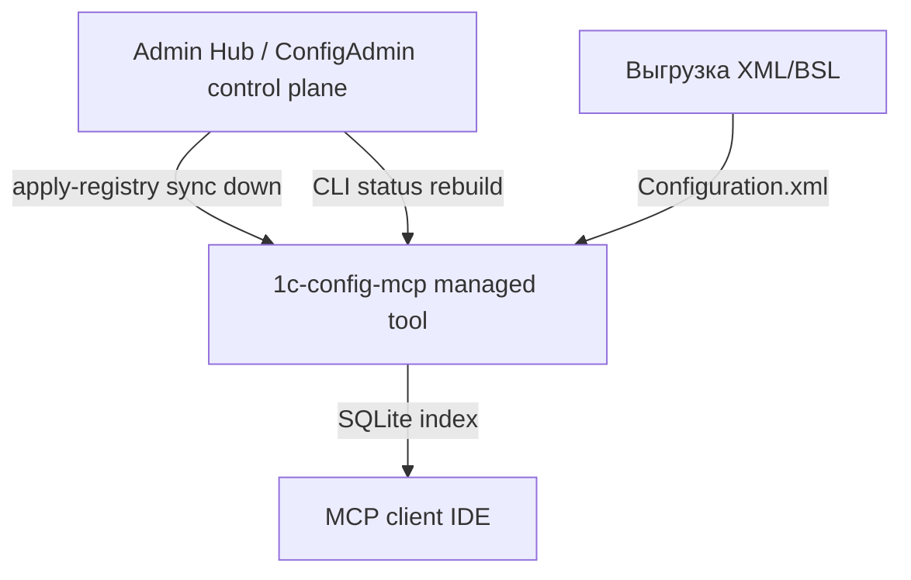

## Интеграция с Admin Hub (config-mcp)

### Статус

- **Протокол:** v1 + addendum v1.0.1 + v1.0.2 + v1.0.3 (при конфликте — приоритет у **v1.0.3**).
- **Phase 1 (read-only):** **реализован** — manifest example, `runtime_paths`, `hub_protocol`, CLI (`inventory`, `status`, `export-registry`), сборка `Tools/1c-config-cli.exe`.
- **Phase 2 (registry sync):** **реализован (core)** — `apply-registry`, `sourcePath`/`sourceKind`, UUID v4, atomic write; `operations.log` — backlog.
- **Phase 3:** не начат (`rebuild-index` CLI, `--trigger-rebuild`).
- **Режим по умолчанию:** `standalone` portable; hub optional.

**CLI (dev):**

```bash
python -m admin_tool.cli --root /path/to/portable status --json
python -m admin_tool.cli --root /path/to/portable apply-registry --input fragment.json --json
```

**Переопределение root:** `--root` или env `CONFIG_MCP_ROOT`.

### Роль модуля в экосистеме



**1C Config MCP** — модуль типа `config-mcp`:

- индексирует выгрузку конфигурации в SQLite;
- отдаёт метаданные и код через MCP (read-only query plane);
- управляет реестром проектов/баз через `projects.json` и admin GUI.

Admin Hub владеет связями клиент → проект → инфобаза; этот модуль материализует свой фрагмент в `projects.json` и выполняет headless-операции (rebuild, status).

### Принципы разработки (обязательные)

1. **Minimum invasive unification** — переиспользовать `ProjectManager`, `DatabaseManager`, `db_build_state`; не переписывать парсер/MCP ради hub.
2. **Три слоя в модуле:** реестр (`projects.json`) → операции (`shared/hub_protocol`) → адаптеры (GUI, MCP server, CLI).
3. **GUI не центр интеграции** — hub вызывает CLI/subprocess, не tkinter.
4. **MCP остаётся query plane** — control-plane операции (rebuild, apply-registry) **не** добавлять в MCP tools.
5. **Portable layout не ломать** — root с `Admin/`, `Server/`, `Tools/`, `projects.json`, `databases/`.
6. **Manifest — source of truth для путей** — hub не угадывает layout; см. addendum §3.
7. **Standalone по умолчанию** — `mode: standalone` в manifest до явного перехода в managed.
8. **Protocol deviation** — отклонения от v1/addendum документировать явно (Deviation, Reason, Impact, Workaround).

### Текущее состояние vs протокол

| Компонент протокола | Статус |
|---------------------|--------|
| `module.manifest.json` | example в репо; копия в portable при `build_all.bat` |
| `Tools/1c-config-cli.exe` | сборка Phase 1 (`build_all.bat`) |
| `inventory --json` | **готово** (`shared/hub_protocol`, `admin_tool/cli`) |
| `status --json` | **готово** |
| `export-registry --json` | **готово** (v1.0.2: `sourcePath`/`sourceKind`) |
| `shared/runtime_paths.py` | **готово** |
| `apply-registry` | **готово** (patch default, atomic write, UUID v4) |
| `shared/cli_json.py` | **готово** (UTF-8 stdout/input, v1.0.3) |
| `shared/source_path.py` | **готово** |
| `rebuild-index` / `rebuild-all` / `reconcile-markers` | Phase 3 |
| `operations.log` | backlog (Phase 2 ops) |

Portable root (после `build_all.bat`):

```text
1c_config_mcp_server_Portable/
  module.manifest.json
  projects.json
  databases/
  Admin/1C-Config-Admin.exe
  Server/1c-config-server.exe
  Tools/1c-config-cli.exe
```

### Ownership (config-mcp)

По addendum v1.0.1 §8.2 / §11.1; уточнения v1.0.2 §5 — **`sourcePath` + `sourceKind`** (см. ниже).

**Hub-owned (sync down → `projects.json`):**

- `projectId`, `clientId`, имя проекта, `active`
- `infobaseId`, имя базы, `type` (`base` | `extension`)
- `sourcePath`, `sourceKind` (`directory` | `archive`), `platformVersion`

**Локальная модель (Phase 2):** canonical `source_path` + `source_kind`; derived `source_xml` (resolved `Configuration.xml` для индексера); legacy записи с одним `source_xml` нормализуются при export/status (lazy read).

**Protocol deviation:** `sourceKind=archive` на apply — **skip** + warning (archive workflow — Phase 3+).

**UTF-8 CLI (v1.0.3):** `1c-config-cli` выводит JSON в stdout как UTF-8 без BOM ([`shared/cli_json.py`](../../shared/cli_json.py)). Dev-запуск и portable после `build_all.bat` соответствуют протоколу; Hub-клиентам не нужен CP1251 fallback.

**Local-owned (модуль, hub не перезаписывает):**

- `db_file`, содержимое `databases/*.db`
- `PRAGMA user_version`, маркеры `.building` / `.tmp`
- кэш SQLite в процессе MCP

**Export-only в fragment:** `indexStatus` (userVersion, isOutdated, isBuilding) — observational metadata.

**ID mapping:** `projects[].id` → `projectId`, `databases[].id` → `infobaseId` в registry fragment; локальный json может сохранять поле `id` для обратной совместимости при чтении.

### Протокол v1.0.2 — влияние на config-mcp

| Требование v1.0.2 | Влияние сейчас (Phase 1) | Phase 2+ |
|-------------------|--------------------------|----------|
| ConfigAdmin = Hub storage | нет | интеграция на стороне ConfigAdmin |
| `sourcePath` + `sourceKind` вместо `sourceXml` | export/status/apply — **готово** | archive workflow — Phase 3 |
| Strict UUID v4 для hub IDs | валидация в `apply-registry` | — |
| Archive workflow (`sourceKind=archive`) | apply: skip + warning | полная поддержка — Phase 3 |
| `followUpOperations` schema | apply-registry при смене sourcePath | rebuild CLI — Phase 3 |
| `staleAfterMs` в locks | опционально | улучшение `status` |
| JSON Schema files | не в этом репо (пакет Hub) | при необходимости — fragment schema |
| Subprocess CLI для config-mcp | **соответствует** (Phase 1 CLI) | — |

**Критичного влияния на MCP/GUI нет:** query plane и tkinter работают как раньше; hub integration через `apply-registry` готова для ConfigAdmin.

### Runtime modes

| Режим | Поведение |
|-------|-----------|
| `standalone` | GUI и локальный `ProjectManager` — primary; hub optional |
| `managed` | `apply-registry` — допустимый admin channel; соблюдать ownership |

Смена режима — только явно (`manifest.mode` или action hub), не при первом discovery.

### Roadmap внедрения

#### Phase 1 — discoverability (read-only) — **готово**

- `shared/runtime_paths.py`, `module.manifest.example.json`, `shared/hub_protocol.py`, `admin_tool/cli.py`, `tests/test_hub_protocol.py`
- `build_all.bat`: `Tools/1c-config-cli.exe`, `module.manifest.json` в portable root

**Критерий:** `python -m admin_tool.cli --root … status --json` без GUI.

#### Phase 2 — registry sync — **готово (core)**

- `shared/registry_apply.py`, `shared/source_path.py`, `shared/registry_ids.py`
- `apply-registry` в `admin_tool/cli.py` (atomic write, patch default, `removedIds`, snapshot mode)
- export/status — `sourcePath`/`sourceKind` (v1.0.2); `followUpOperations` при смене source
- тесты `tests/test_registry_apply.py`

**Критерий:** hub apply + MCP `active_databases` согласованы по mtime `projects.json`.

**Осталось в backlog:** `operations.log` (append-only audit trail).

#### Phase 3 — headless operations

- CLI: `rebuild-index`, `rebuild-all`, `reconcile-markers`
- `--trigger-rebuild` на apply (optional)
- связка с `gui-bulk-update` в backlog

**Критерий:** rebuild stale indexes без tkinter.

### Связь с существующим backlog

| Backlog | Связь с hub protocol |
|---------|----------------------|
| `gui-bulk-update` | Phase 3 — общий code path с `rebuild-all` |
| `gui-build-log-timings` | events → `operations.log` |
| `gui-cancel-build` | cooperative cancel в hub rebuild API |
| `refactor-god-modules` | косвенно — вынести ops до Phase 2 |

### Что не делать в этом репозитории

- реализовывать Admin Hub / master registry;
- MCP tools для rebuild/delete/apply;
- миграции SQLite (политика NO_DB_MIGRATIONS сохраняется);
- обязательную зависимость от hub при старте admin/MCP.

### Отклонения и версии

При конфликте между v1, v1.0.1 и v1.0.2 — **приоритет у v1.0.2** ([`protocol-v1.0.2-addendum.md`](protocol-v1.0.2-addendum.md)).

Планируемое отклонение (зафиксировать при реализации, если останется):

- CLI в `Tools/`, не в `Server/` — согласовано с addendum §4.1 (`cliExe`: `Tools/1c-config-cli.exe`).
