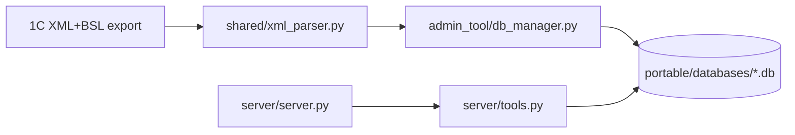

## Архитектура

### Поток данных (high level)

### Основные компоненты

- **Парсер выгрузки 1С**: `shared/xml_parser.py`
  - Вход: путь к `Configuration.xml` в каталоге выгрузки.
  - Выход: структура `data` (конфигурация, список объектов, их свойства/формы/модули).
  - Важно: обработка типов метаданных ограничена whitelist’ом `object_types`.

- **Построение SQLite БД**: `admin_tool/db_manager.py`
  - Создаёт схему таблиц и загружает данные.
  - Индексирует код модулей в FTS5 (`code_search`) и процедуры/функции (`module_procedures`).
  - Важно: миграций нет — только пересоздание БД при изменениях (см. `docs/database.md`).

- **MCP сервер**: `server/server.py`
  - Регистрирует инструменты и отдаёт их MCP-клиенту.

- **Инструменты MCP (запросы к SQLite)**: `server/tools.py`
  - Читает список активных баз/проектов через `shared/project_manager.py` и runtime-конфиг `projects.json` (лежит рядом с portable-экземпляром, не в исходниках).
  - Использует кэш соединений SQLite, инвалидируя соединение при изменении `mtime` файла базы.

