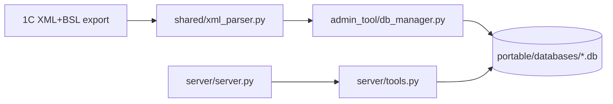

## Architecture

### Data flow (high level)

```mermaid
flowchart LR
  Export[1C XML+BSL export] --> Parser[shared/xml_parser.py]
  Parser --> DbBuilder[admin_tool/db_manager.py]
  DbBuilder --> SQLite[(portable/databases/*.db)]
  MCP[server/server.py] --> Tools[server/tools.py]
  Tools --> SQLite
```

### Portable and Admin Hub (target model)

Currently the module is an autonomous portable (`Admin/`, `Server/`, `projects.json`, `databases/`). Target direction — **managed tool** of the Admin Hub protocol: manifest + thin CLI + sync registry, without moving the hub into this repo. MCP server remains a read-only adapter; control-plane — CLI and GUI over the shared service layer.

Details: [`admin-hub-integration.md`](admin-hub-integration.md).

### Product policies (do not violate)

- **NO_DB_MIGRATIONS**: never write migrations for existing SQLite databases in `databases/`. After schema/import logic changes, databases are **always recreated** via `admin_tool` from the source export. See [`database.md`](database.md).
- **`INDEXER_VERSION`**: on incompatible schema/data changes, bump the constant in `shared/indexer_version.py` (`.cursor/rules/bump-indexer-version.mdc`).
- **Metadata type whitelist**: the parser handles only types from `shared/xml_parser.py` (`object_types`). New types are added incrementally with type-specific considerations ([`metadata-whitelist.md`](metadata-whitelist.md)).
- **Sources vs runtime (portable)**: sources must not contain runtime state (`projects.json`, `databases/*.db`). These live next to the portable instance and are changed via `admin_tool`.
- **Responsibility split**: the agent changes sources; the user rebuilds portable/server and databases; the agent verifies results on the connected MCP via tool calls.
- **Parser: rely on real exports**: when extending `shared/xml_parser.py` and import in `admin_tool/db_manager.py`, rely on real XML/BSL export files. If export paths are not provided, ask the user. External materials — only after reviewing a real file or explicit user confirmation.
- **Testing**: functional verification on the **working MCP** (connected in IDE) via **actual tool calls**, always starting with `active_databases`; no parser simulation, no direct SQLite reads ([`testing-protocol.md`](testing-protocol.md)).
- **Group sync**: shared protocol canon — Head `docs/group/shared/`; local snapshot — `docs/group/protocol-ref/epoch<N>/`; hub at `<head.path>/GROUP-HUB.md`; skill **`sync`**.

### Terms

- **Real / working MCP**: MCP server connected in the IDE; verify via tool calls, not by name alone (`serverIdentifier` vs `serverName` may differ).
- **Admin Hub vs group hub**: Admin Hub protocol (managed tool CLI) — [`admin-hub-integration.md`](admin-hub-integration.md); group protocol sync — [`group/integration.md`](group/integration.md) and Head `GROUP-HUB.md`.

### Main components

- **1C export parser**: `shared/xml_parser/` (package: `core.py` dispatch, `forms.py`, `sections.py`, `flowchart.py`, `modules.py`, `types.py`, `xml_helpers.py` — mixins composed into `ConfigurationParser`)
  - Input: path to `Configuration.xml` in the export directory.
  - Output: `data` structure (configuration, object list, properties/forms/modules).
  - Important: metadata type handling is limited to the `object_types` whitelist.

- **SQLite DB builder**: `admin_tool/db_manager/` (package: `core.py`, `schema.py`, `insert_objects.py`, `insert_forms.py`, `relations.py`, `file_ops.py`, `bsl.py` — mixins composed into `DatabaseManager`)
  - Creates table schema and loads data.
  - Indexes module code in FTS5 (`code_search`) and procedures/functions (`module_procedures`).
  - Important: no migrations — only DB recreation on changes (see `docs/database.md`).

- **MCP server**: `server/server.py` (thin: tool registration + dispatch wiring) + `server/tool_schemas.py` (Tool schemas) + `server/dispatch/` (per-domain response formatting)
  - Registers tools and exposes them to the MCP client.

- **MCP tools (SQLite queries)**: `server/tools/` (package: `base.py`, `objects.py`, `code.py`, `forms.py`, `relations.py`, `formatting.py` — mixins composed into `ConfigurationTools`)
  - Reads active databases/projects via `shared/project_manager.py` and runtime config `projects.json` (lives next to the portable instance, not in sources).
  - Uses SQLite connection cache, invalidating the connection when the DB file `mtime` changes.

### Core data schema (target model)

Three layers — **do not mix**:

| Layer | Table | Purpose |
|-------|-------|---------|
| Catalog | `metadata_objects` | Configuration objects + synthetic `TypeDescriptor` (primitives) |
| Type system | `metadata_type_slots` | Attribute types, tabular section columns, form fields (FK, not strings) |
| Structural relations | `metadata_relations` | Subsystems, roles, subscriptions — not expressible as field types |

**Unified catalog:** reference type `CatalogRef.X` points **directly** to object `Catalog.X` in `metadata_objects`. A separate type catalog with wrappers around objects is **not** used.

**Domain tables** (`fo_content_ref`, `scheduled_jobs`, …) coexist with the core; **do not** duplicate them in `metadata_relations`.

Full spec: [`dependency-layer.md`](dependency-layer.md). **Type system (metadata + forms)**, **`find_referencing_objects`** (slots + `metadata_relations` for subsystems) are implemented (`INDEXER_VERSION` 10); roles and subscriptions — in backlog ([`todo.md`](todo.md)).

### Indexing principles

- The parser **quickly** stores normalized facts; attribute/column types for metadata and **forms** — in `metadata_type_slots` (see [`form-type-system.md`](form-type-system.md)).
- **Complex query semantics** — in tools; **technical indexes** (FTS, FK on slots) — where otherwise full scan.
- Add new whitelist types **incrementally** by tier: light (Subsystem) → medium (Role MVP) → heavy (DCS, RLS) as separate epics.
- Build bottleneck on large configurations — **forms and BSL**, not type slot INSERTs.

### Rules for inclusion in `metadata_objects`

Only what **has reference relations**: whitelist objects, `TypeDescriptor`, later `DefinedType`.

**Do not add by default:** XDTO wholesale, service artifacts without FK.

Field `object_kind`: `ConfigObject` | `TypeDescriptor`. Tools filter `ConfigObject` for object lists.

### Tool priority for the agent

1. `get_object_structure` — structure and outgoing types
2. `find_referencing_objects` — reverse references by slots (**done**)
3. `get_functional_options` — functional options
4. `search_code` — when metadata did not answer

See [`mcp-tools.md`](mcp-tools.md).

### Extended documentation index

| Document | Topic |
|----------|-------|
| [`database.md`](database.md) | SQLite schema, FTS5, NO_DB_MIGRATIONS |
| [`metadata-whitelist.md`](metadata-whitelist.md) | Parser `object_types` whitelist |
| [`dependency-layer.md`](dependency-layer.md) | Type slots, `metadata_relations` phases |
| [`form-type-system.md`](form-type-system.md) | Form field types in slots |
| [`testing-protocol.md`](testing-protocol.md) | MCP verification protocol |
| [`performance.md`](performance.md) | Performance notes |
| [`admin-hub-integration.md`](admin-hub-integration.md) | Admin Hub managed-tool roadmap and CLI |
| [`group/integration.md`](group/integration.md) | Group hub link and protocol state |
| [`group/protocol-ref/epoch0/`](group/protocol-ref/epoch0/) | Protocol snapshot (reference only) |
