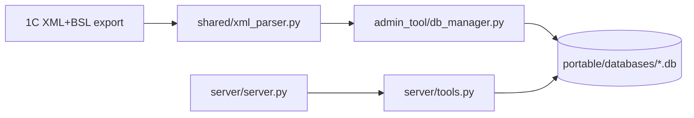

## Архитектура

### Поток данных (high level)

```mermaid
flowchart LR
  Export[1C XML+BSL export] --> Parser[shared/xml_parser.py]
  Parser --> DbBuilder[admin_tool/db_manager.py]
  DbBuilder --> SQLite[(portable/databases/*.db)]
  MCP[server/server.py] --> Tools[server/tools.py]
  Tools --> SQLite
```

### Основные компоненты

- **Парсер выгрузки 1С**: `shared/xml_parser.py`
  - Вход: путь к `Configuration.xml` в каталоге выгрузки.
  - Выход: структура `data` (конфигурация, список объектов, их свойства/формы/модули).
  - Важно: обработка типов метаданных ограничена whitelist’ом `object_types`.

- **Построение SQLite БД**: `admin_tool/db_manager.py`
  - Создаёт схему таблиц и загружает данные.
  - Индексирует код модулей в FTS5 (`code_search`) и процедуры/функции (`module_procedures`).
  - Важно: миграций нет — только пересоздание БД при изменениях (см. `docs/database.md`).

- **MCP сервер**: `server/server.py`
  - Регистрирует инструменты и отдаёт их MCP-клиенту.

- **Инструменты MCP (запросы к SQLite)**: `server/tools.py`
  - Читает список активных баз/проектов через `shared/project_manager.py` и runtime-конфиг `projects.json` (лежит рядом с portable-экземпляром, не в исходниках).
  - Использует кэш соединений SQLite, инвалидируя соединение при изменении `mtime` файла базы.

### Ядро схемы данных (целевая модель)

Три слоя — **не смешивать**:

| Слой | Таблица | Назначение |
|------|---------|------------|
| Каталог | `metadata_objects` | Объекты конфигурации + синтетические `TypeDescriptor` (примитивы) |
| Типовая система | `metadata_type_slots` | Типы реквизитов, колонок ТЧ, полей форм (FK, не строки) |
| Структурные связи | `metadata_relations` | Подсистемы, роли, подписки — не выражается типом поля |

**Единый каталог:** ссылочный тип `CatalogRef.X` указывает **напрямую** на объект `Catalog.X` в `metadata_objects`. Отдельный каталог типов с обёртками вокруг объектов **не** используется.

**Domain-таблицы** (`fo_content_ref`, `scheduled_jobs`, …) сосуществуют с ядром; **не** дублировать их в `metadata_relations`.

Подробная спека: [`dependency-layer.md`](dependency-layer.md). **Type system (metadata + формы)** реализован (`INDEXER_VERSION` 9); relations и `find_referencing_objects` — в backlog ([`todo.md`](todo.md)).

### Принципы индексации

- Парсер **быстро** кладёт нормализованные факты; типы реквизитов/колонок metadata и **форм** — в `metadata_type_slots` (см. [`form-type-system.md`](form-type-system.md)).
- **Сложная семантика выборки** — в tools; **технические индексы** (FTS, FK на слоты) — где иначе full scan.
- Новые типы whitelist добавлять **точечно** по tier: лёгкие (Subsystem) → средние (Role MVP) → тяжёлые (СКД, RLS) отдельными эпиками.
- Узкое место сборки на крупных конфигурациях — **формы и BSL**, не INSERT слотов типов.

### Правила включения в `metadata_objects`

Попадает только то, **на что есть ссылочные отношения**: объекты whitelist, `TypeDescriptor`, позже `DefinedType`.

**Не класть по умолчанию:** XDTO целиком, служебные артефакты без FK.

Поле `object_kind`: `ConfigObject` | `TypeDescriptor`. Tools фильтруют `ConfigObject` для списков объектов.

### Приоритет tools для агента

1. `get_object_structure` — структура и исходящие типы
2. `find_referencing_objects` — обратные ссылки (фаза 2, в backlog)
3. `get_functional_options` — ФО
4. `search_code` — если метаданные не ответили

См. [`mcp-tools.md`](mcp-tools.md).
