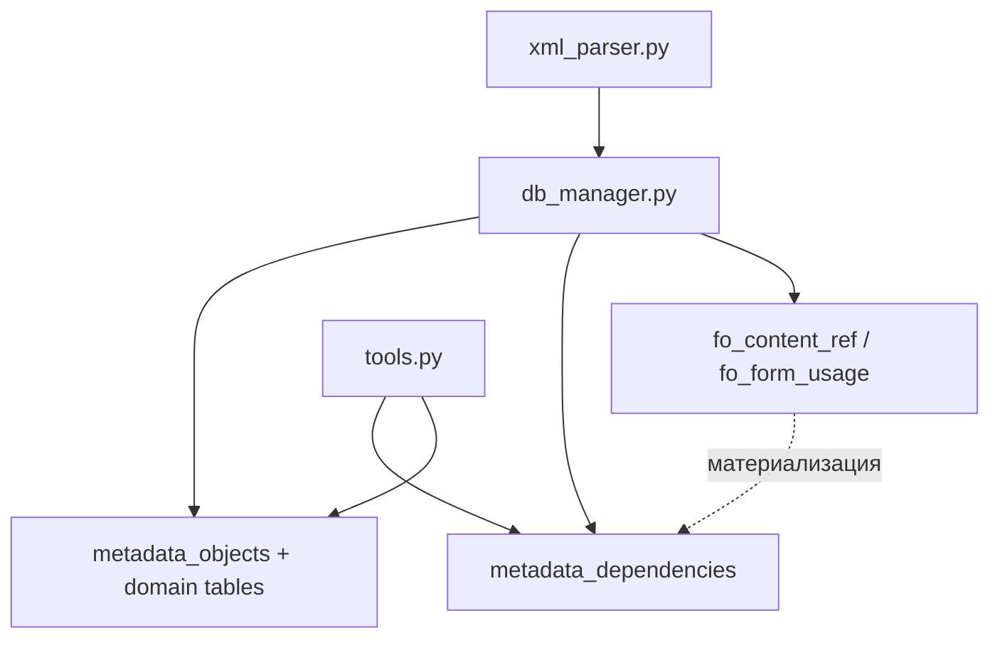

## Metadata dependency layer (план реализации)

Документ фиксирует проектный дизайн **слоя межобъектных зависимостей метаданных** — следующего крупного шага развития индексатора. Статус: **не реализовано**, готово к работе.

Связанные документы: `architecture.md`, `database.md`, `mcp-tools.md`, `metadata-whitelist.md`, `todo.md`.

---

### Зачем

Текущая схема хорошо закрывает:

- поиск и структуру объектов;
- формы и UI;
- код модулей (FTS5, процедуры);
- функциональные опции (`fo_content_ref`, `fo_form_usage`);
- регламентные задания (`scheduled_jobs`).

Слабо закрыты вопросы **графа метаданных**:

- на какие объекты ссылается документ/справочник (типы реквизитов);
- кто ссылается на этот регистр/справочник;
- в каких подсистемах состоит объект;
- какие роли дают доступ к объекту;
- кто подписан на событие (после добавления `EventSubscription`).

Сейчас ссылочные типы живут текстом в `attributes.attribute_type` и `tabular_section_columns.column_type` без нормализованного индекса для обратных запросов.

---

### Принципы (что не делать)

- **Не** graph DB и **не** vector-first — SQLite adjacency-list достаточен.
- **Не** closure table и транзитивные зависимости на старте — только прямые рёбра; обход `depth > 1` позже через recursive CTE.
- **Не** смешивать с кодовым графом (BSL, СКД, «документ двигает регистр») на первом этапе.
- **Не** отдельные `nodes/edges` — `metadata_objects` уже каталог узлов.
- **Не** колонки `project_name` / `extension_name` в таблице зависимостей: один файл `.db` = одна база (основная или расширение); граница проекта/расширения — на уровне выбора файла в MCP (`project_filter`, `extension_filter`), как у всех остальных таблиц.
- **Не** миграции — новая схема → bump `INDEXER_VERSION` → пересборка через `admin_tool` (см. `database.md`).

---

### Архитектурное место



**Гибридная модель:** domain-таблицы (`fo_*`, позже `subsystem_content`, `role_permissions`) остаются источником при импорте; `metadata_dependencies` — **унифицированный query-индекс** для MCP tools. Заполняется в конце `_insert_configuration` одним проходом из нескольких источников.

---

### Схема БД (план)

#### Таблица `metadata_dependencies`

```sql
CREATE TABLE metadata_dependencies (
    id INTEGER PRIMARY KEY,

    src_object_id INTEGER NOT NULL,
    dst_object_id INTEGER NOT NULL,

    dependency_type TEXT NOT NULL,
    source_kind TEXT NOT NULL,
    source_name TEXT,
    source_path TEXT,

    confidence REAL NOT NULL DEFAULT 1.0,
    is_direct INTEGER NOT NULL DEFAULT 1,

    FOREIGN KEY (src_object_id) REFERENCES metadata_objects(id),
    FOREIGN KEY (dst_object_id) REFERENCES metadata_objects(id)
);

CREATE INDEX ix_md_dep_src ON metadata_dependencies(src_object_id);
CREATE INDEX ix_md_dep_dst ON metadata_dependencies(dst_object_id);
CREATE INDEX ix_md_dep_type ON metadata_dependencies(dependency_type);

CREATE UNIQUE INDEX ux_md_dep_unique ON metadata_dependencies(
    src_object_id,
    dst_object_id,
    dependency_type,
    COALESCE(source_kind, ''),
    COALESCE(source_name, ''),
    COALESCE(source_path, '')
);
```

| Поле | Назначение |
|------|------------|
| `src_object_id` / `dst_object_id` | `metadata_objects.id` |
| `dependency_type` | Тип ребра (см. ниже) |
| `source_kind` | Откуда взята связь: `attribute`, `tabular_section_column`, `subsystem`, `role`, `functional_option`, `event_subscription`, … |
| `source_name` | Имя реквизита, колонки ТЧ, элемента |
| `source_path` | Доп. путь (например права роли: `Read, Insert`) |
| `confidence` | 1.0 для точных связей; < 1 при нерезолвимых/эвристических |
| `is_direct` | Пока всегда 1; задел на транзитивные записи в будущем |

Отдельные `metadata_dependency_points` для форм/команд — **не на старте**; реквизиты и элементы указываются через `source_kind` / `source_name`.

---

### Типы зависимостей

#### Фаза 1 — точные, делать сразу

| `dependency_type` | Направление | Источник при сборке |
|-------------------|-------------|---------------------|
| `attribute_ref` | объект → объект | `attributes` (section Attribute/Dimension/Resource) |
| `tabular_section_column_ref` | объект → объект | `tabular_section_columns` |
| `fo_content` | ФО → объект | `fo_content_ref` |
| `fo_form_usage` | ФО → объект-владелец формы | `fo_form_usage` |

#### Фаза 2 — после расширения whitelist

| `dependency_type` | Направление | Источник |
|-------------------|-------------|----------|
| `subsystem_contains` | подсистема → объект | парсинг `Subsystem` |
| `role_grants` | роль → объект | парсинг `Role` (MVP: факт доступа; детали прав в `source_path`) |
| `event_subscription_source` | подписка → объект-источник | `EventSubscription` |
| `event_subscription_handler` | подписка → CommonModule (объект) | `EventSubscription.Handler` |

#### Пока не делать

- `document_posts_to_register` — кодовая/эвристическая связь;
- `form_uses_object` — из `data_path` формы, отдельная эвристика;
- `module_uses_object` — анализ BSL.

---

### Наполнение при сборке

#### 1. Ссылки из реквизитов и колонок ТЧ

Парсер уже сохраняет типы строкой (`_extract_attribute_type` в `xml_parser.py`), например `CatalogRef.Номенклатура` или составной через запятую.

При импорте — resolver (новый модуль или функция в `shared/`):

```
CatalogRef.X        → Catalog / X
DocumentRef.X       → Document / X
EnumRef.X           → Enum / X
…
составной тип       → несколько строк metadata_dependencies
нерезолвимый тип    → пропуск или confidence < 1.0
```

Переиспользовать идеи `_parse_content_ref` в `db_manager.py` (уже разбирает `Document.Имя.Attribute.Рек` для ФО).

Вставка:

```sql
INSERT OR IGNORE INTO metadata_dependencies (
    src_object_id, dst_object_id,
    dependency_type, source_kind, source_name, confidence
) VALUES (?, ?, 'attribute_ref', 'attribute', ?, 1.0);
```

Для колонок ТЧ: `source_kind = 'tabular_section_column'`, `dependency_type = 'tabular_section_column_ref'`.

#### 2. Функциональные опции

Таблицы `fo_content_ref` и `fo_form_usage` **не удалять**. После их заполнения — материализовать в `metadata_dependencies` (`dependency_type`: `fo_content`, `fo_form_usage`).

#### 3. Подсистемы (фаза 2)

- Добавить `Subsystem` в whitelist (`metadata-whitelist.md`).
- Парсить состав подсистемы из XML.
- `src = subsystem`, `dst = object`, `dependency_type = subsystem_contains`.

#### 4. Роли (фаза 2)

- Добавить `Role` в whitelist.
- MVP: `role_grants` без полной модели RLS; права — в `source_path` или отдельная таблица `role_permissions` при необходимости.
- **Требуется реальная выгрузка** для разбора XML.

#### 5. Подписки на события (фаза 2)

- Добавить `EventSubscription` в whitelist.
- Связи handler → `CommonModule` + процедура (пересекается с кодовым слоем, но metadata-level достаточно для «кто подписан»).

---

### Новые MCP tools (план)

Регистрация: `server/server.py`. Реализация: `server/tools.py`.

#### `find_metadata_dependencies`

Исходящие зависимости: «от чего зависит объект X».

Параметры:

| Параметр | Обязательный | Описание |
|----------|--------------|----------|
| `object_name` | да | Имя объекта |
| `project_filter` | да | |
| `extension_filter` | нет | |
| `dependency_types` | нет | Фильтр типов, напр. `["attribute_ref", "fo_content"]` |
| `max_results` | нет | По умолчанию 100 |

Ответ: объект + зависимости, сгруппированные по `dependency_type`.

#### `find_metadata_dependents`

Обратный поиск: «кто зависит от объекта X» (ссылки на справочник, роли, подсистемы).

Те же параметры; SQL по `dst_object_id`.

#### `find_dependency_path` (позже)

Рекурсивный обход `depth` 2+; не в MVP. SQLite recursive CTE с лимитом `max_depth` и `max_results`.

#### Обогащение `get_object_structure` (опционально, фаза 2)

Краткий блок `references_to` / `referenced_by` (top-N), не полная замена отдельных tools.

---

### SQL-шаблоны для tools

**Исходящие:**

```sql
SELECT
    d.dependency_type,
    d.source_kind,
    d.source_name,
    dst.object_type AS dst_object_type,
    dst.name AS dst_name,
    dst.synonym AS dst_synonym,
    d.confidence
FROM metadata_dependencies d
JOIN metadata_objects src ON src.id = d.src_object_id
JOIN metadata_objects dst ON dst.id = d.dst_object_id
WHERE src.name = :object_name
ORDER BY d.dependency_type, dst.object_type, dst.name
LIMIT :max_results;
```

**Входящие:** тот же запрос с `WHERE dst.name = :object_name` и полями `src_*`.

**Двухшаговый обход (позже):** recursive CTE по `metadata_dependencies` с `depth < :max_depth` и защитой от циклов (`instr(path, ...)`).

---

### Точки изменения в коде

| Файл | Изменения |
|------|-----------|
| `shared/xml_parser.py` | Resolver ссылочных типов; парсинг Subsystem, Role, EventSubscription (фазы 2–3) |
| `shared/` (новый модуль?) | `resolve_metadata_ref(type_string) → [(object_type, object_name), …]` |
| `admin_tool/db_manager.py` | `_create_schema`: `metadata_dependencies`; наполнение в конце `_insert_configuration` |
| `shared/indexer_version.py` | Bump при каждой несовместимой схеме |
| `server/tools.py` | `find_metadata_dependencies`, `find_metadata_dependents` |
| `server/server.py` | Регистрация tools |
| `docs/mcp-tools.md` | Описание новых tools после реализации |

---

### Roadmap реализации

| Фаза | INDEXER_VERSION | Содержание | Зависимости |
|------|-----------------|------------|-------------|
| **0** | — | `find_object`: поиск по `name OR synonym` | Нет схемы; см. `find-object-synonym` в `todo.md` |
| **1** | +1 | Таблица `metadata_dependencies`; `attribute_ref`, `tabular_section_column_ref`; tools `find_metadata_*` | Resolver типов реквизитов |
| **2** | +1 | Материализация `fo_content_ref`, `fo_form_usage`; опционально summary в `get_object_structure` | Фаза 1 |
| **3** | +1 | Whitelist `Subsystem`; `subsystem_contains` | XML выгрузки с `Subsystems/` |
| **4** | +1 | Whitelist `Role`; `role_grants` | Реальная выгрузка ролей |
| **5** | +1 | `EventSubscription`; `event_*` типы | Реальная выгрузка |
| **отдельно** | — | Поиск РЗ по `MethodName` | JOIN с `scheduled_jobs`, не dependency layer |

---

### Риски и ограничения

| Риск | Митигация |
|------|-----------|
| Дублирование `fo_*` и `metadata_dependencies` | Единая функция материализации в конце сборки |
| Большой объём `attribute_ref` на крупных конфигурациях | Нормально для SQLite; индексы по `src`/`dst`; лимиты в tools |
| Сложный XML ролей | MVP без полных прав; итеративное расширение |
| Нерезолвимые типы (`DefinedType`, составные cfg) | Пропуск или `confidence < 1.0`; расширять resolver по мере необходимости |
| Раздувание `get_object_structure` | Summary top-N или только отдельные tools |

---

### Что сознательно отложено

- Материализация `command_source` в БД (сейчас вычисляется в `tools.py`) — низкий приоритет.
- Структурный разбор `form_conditional_appearance` (сырой XML) — отдельная задача.
- Cached snapshot / materialized summary для `get_object_structure` — только при подтверждённой нагрузке.
- Closure table, vector search, code dependency graph.

---

### Критерии готовности фазы 1

1. После пересборки БД в `metadata_dependencies` есть строки для ссылочных реквизитов известных типов.
2. `find_metadata_dependencies` для документа возвращает ссылочные объекты из реквизитов.
3. `find_metadata_dependents` для справочника возвращает объекты, у которых есть `CatalogRef.ЭтотСправочник`.
4. Тесты на resolver и вставку (unit); функциональная проверка через MCP (см. `testing-protocol.md`).
5. `INDEXER_VERSION` увеличен; `mcp-tools.md` обновлён.
