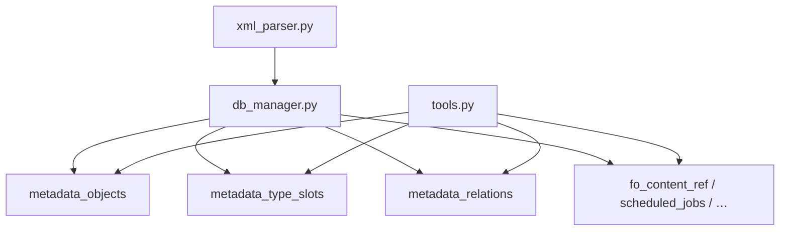

## Type system и structural relations (план)

Документ фиксирует **целевую архитектуру** нормализации типов и структурных связей метаданных. **Type system (metadata + формы, v9)**, **фаза 0** (`find_object` по `synonym`), **фаза 2** (`find_referencing_objects` по слотам) и **фаза 3** (`metadata_relations`, `Subsystem`) реализованы; фазы 4–5 — в backlog ([`todo.md`](todo.md)).

Связанные документы: [`architecture.md`](architecture.md), [`database.md`](database.md), [`mcp-tools.md`](mcp-tools.md), [`metadata-whitelist.md`](metadata-whitelist.md), [`form-type-system.md`](form-type-system.md), [`todo.md`](todo.md).

---

### Зачем

Текущая схема хорошо закрывает поиск объектов, формы, код (FTS5), ФО, регламентные задания, **обратный поиск по типам полей** (`find_referencing_objects`, фаза 2).

Ещё не закрыто:

- **структурные связи** — роли, подписки (фазы 4–5, `metadata_relations`);
- **DynamicList Settings** на формах (MainTable, СКД) — см. `form-dynamiclist-settings` в [`todo.md`](todo.md) (смежная ось type system форм, не `metadata_relations`).

---

### Архитектурные принципы

1. **Единый каталог** — `metadata_objects`: реальные объекты конфигурации и синтетические дескрипторы примитивов (`TypeDescriptor`). Ссылочный тип `CatalogRef.X` — это **сам объект** `Catalog.X`, без отдельной обёртки.
2. **Три слоя** — не смешивать:
   - **каталог** — `metadata_objects`;
   - **типовая система** — `metadata_type_slots` (какие типы у реквизита/колонки/поля формы);
   - **структурные связи** — `metadata_relations` (подсистема, роль, подписка — то, что **не** выражается типом поля).
3. **Строки типов не источник правды** — после импорта типы только через FK; сырая строка из XML не хранится (допустим `type_display` только для отладки).
4. **Domain-таблицы не дублировать** — `fo_content_ref`, `fo_form_usage`, `scheduled_jobs` остаются; в общий граф **не** материализовать.
5. **Сложность выборки — в tools**; индексы и FK — в БД там, где иначе full scan (обратный поиск по типам).
6. **Не** graph DB, **не** closure table на старте, **не** миграции — bump `INDEXER_VERSION` + пересборка (`database.md`).

#### Правила включения в `metadata_objects`

В каталог попадает только то, **на что есть ссылочные отношения**:

- объекты конфигурации из whitelist;
- синтетические `TypeDescriptor` (примитивы с квалификаторами);
- позже — `DefinedType` как обычный объект whitelist.

**Не класть по умолчанию:** XDTO-схемы целиком, служебные артефакты, blob без FK, всё подряд из XML.

#### Критерий materialize vs query-time

| Ситуация | Где |
|----------|-----|
| Типы реквизитов, составные типы | `metadata_type_slots` при импорте |
| Обратный поиск по ссылочным типам | Индекс `metadata_type_slots.object_id` |
| Подсистема / роль / подписка | `metadata_relations` |
| Производные для UI (`command_source`) | Tool |
| Полнотекстовый поиск кода | FTS5 (`code_search`) |

---

### Архитектурное место



---

### Слой 1: расширение `metadata_objects`

Новые поля (имена уточняются при реализации):

| Поле | Назначение |
|------|------------|
| `object_kind` | `ConfigObject` \| `TypeDescriptor` |
| `is_primitive` | `1` для синтетических примитивов |
| `base_type` | `Number`, `String`, `Date`, … — только у `TypeDescriptor` |
| `qualifier_1..3` | Квалификаторы примитива (длина, точность, …) |

**`ConfigObject`** — объекты из whitelist (`Catalog`, `Document`, …), с uuid из XML.

**`TypeDescriptor`** — синтетика, напр. `Число(10,2)`; `uuid` пустой; UNIQUE по `(base_type, qualifier_1, qualifier_2, qualifier_3)`.

**Ссылочный тип** в слоте указывает **напрямую** на `metadata_objects.id` объекта `ConfigObject`, не на отдельную запись «типа».

Tools `list_objects`, `find_object` фильтруют `object_kind = 'ConfigObject'` (примитивы не показываются как объекты конфигурации).

---

### Слой 2: `metadata_type_slots`

Одна **позиция типа** у реквизита, колонки ТЧ или поля формы. Составной тип (`CatalogRef.X, Number`) — несколько слотов с `ordinal`.

```sql
CREATE TABLE metadata_type_slots (
    id INTEGER PRIMARY KEY,

    source_table TEXT NOT NULL,
    source_row_id INTEGER NOT NULL,
    src_object_id INTEGER NOT NULL,

    object_id INTEGER NOT NULL,
    ordinal INTEGER NOT NULL DEFAULT 0,

    FOREIGN KEY (object_id) REFERENCES metadata_objects(id),
    FOREIGN KEY (src_object_id) REFERENCES metadata_objects(id)
);

CREATE INDEX ix_mts_object ON metadata_type_slots(object_id);
CREATE INDEX ix_mts_src_object ON metadata_type_slots(src_object_id);
CREATE INDEX ix_mts_source ON metadata_type_slots(source_table, source_row_id);
```

| Поле | Назначение |
|------|------------|
| `source_table` | `attributes`, `tabular_section_columns`, `form_attributes`, … |
| `source_row_id` | id строки источника |
| `src_object_id` | object-владелец (денормализация для object-level запросов) |
| `object_id` | FK на `metadata_objects` — объект **или** `TypeDescriptor` |
| `ordinal` | Порядок в составном типе |

#### Наполнение

1. Парсер извлекает из XML **структуру слотов** (тип + квалификаторы), не только строку.
2. `shared/metadata_type_resolver.py` (`MetadataTypeResolver`):
   - ссылочный тип → lookup `metadata_objects` по `(object_type, name)`;
   - примитив → `get_or_create` `TypeDescriptor` (кэш в памяти при сборке);
   - составной → несколько слотов.
3. Колонки `attribute_type` / `column_type` / `form_attributes.type` **убраны**; источник правды — слоты.

**MVP типов:** примитивы с базовыми квалификаторами + ссылочные типы + составные слоты. `DefinedType`, `AnyRef`, `TypeSet` — итеративно.

---

### Слой 3: `metadata_relations`

Только связи, которые **не** выражаются типом поля:

```sql
CREATE TABLE metadata_relations (
    id INTEGER PRIMARY KEY,

    src_object_id INTEGER NOT NULL,
    dst_object_id INTEGER NOT NULL,

    relation_kind TEXT NOT NULL,
    source_name TEXT,
    source_detail TEXT,

    FOREIGN KEY (src_object_id) REFERENCES metadata_objects(id),
    FOREIGN KEY (dst_object_id) REFERENCES metadata_objects(id)
);

CREATE INDEX ix_mrel_src ON metadata_relations(src_object_id);
CREATE INDEX ix_mrel_dst ON metadata_relations(dst_object_id);
CREATE INDEX ix_mrel_kind ON metadata_relations(relation_kind);
```

| `relation_kind` | Направление | Когда |
|-----------------|-------------|-------|
| `subsystem_member` | подсистема → объект | whitelist `Subsystem` |
| `role_grant` | роль → объект | whitelist `Role` — см. [`roles-layer.md`](roles-layer.md) |
| `event_source` | подписка → объект-источник | `EventSubscription` |
| `event_handler` | подписка → CommonModule | `EventSubscription` |

**Не класть сюда:** ссылки реквизитов (это слоты), ФО (`fo_content_ref`), кодовый граф, СКД.

---

### MCP tools (план для агента)

Приоритет для агента (зафиксировать в `mcp-tools.md`):

1. Структура и **исходящие** типы → `get_object_structure`
2. **Входящие** ссылки и связи → `find_referencing_objects`
3. ФО → `get_functional_options`
4. Код → `search_code` (если метаданные не помогли)

#### Обогащение `get_object_structure`

У реквизитов/колонок — resolved types вместо строк:

```json
{
  "name": "Владелец",
  "types": [
    { "kind": "object", "object_type": "Catalog", "name": "Контрагенты", "synonym": "…" }
  ]
}
```

Составной тип — массив `types` из нескольких элементов.

#### `find_referencing_objects` (один tool, не пара)

Обратный поиск: «кто ссылается / связан с объектом X».

Параметры: `object_name`, `project_filter`, `extension_filter`, опционально `relation_kinds`, `max_results`.

SQL — **UNION** двух источников:

- **типовые ссылки:** `metadata_type_slots` WHERE `object_id = :target` (только `ConfigObject` targets);
- **структурные:** `metadata_relations` WHERE `dst_object_id = :target`.

В ответе — метка источника: `via: attribute` / `via: subsystem_member` / …

**Отдельный tool для исходящих зависимостей не планируется** — это покрывает `get_object_structure`.

#### Позже

- `find_relation_path` — transitive CTE, `depth > 1`;
- top-N `referenced_by` summary в `get_object_structure` (опциональный параметр).

#### ФО

`get_functional_options` без изменений концепции; **не** дублировать в `metadata_relations`.

---

### Roadmap реализации

| Фаза | INDEXER_VERSION | Содержание | Статус |
|------|-----------------|------------|--------|
| **0** | — | `find_object` по `synonym` | **готово** |
| **1** | 8 | metadata: `TypeDescriptor`, `metadata_type_slots`, `get_object_structure.types` | **готово** |
| **1b** | 9 | формы: `form_attribute_columns`, `get_form_structure.types` — [`form-type-system.md`](form-type-system.md) | **готово** |
| **2** | — | `find_referencing_objects` (слоты metadata + формы) | **готово** |
| **3** | 10 | `metadata_relations`; whitelist `Subsystem` | **готово** |
| **4** | +1 | whitelist `Role` — grants, restrictions, templates; MCP role tools | spec: [`roles-layer.md`](roles-layer.md) |
| **5** | +1 | `EventSubscription` | blocked (выгрузка) |
| **отдельно** | — | Поиск РЗ по `MethodName` | backlog |
| **Tier 3** | — | СКД, RLS, code graph | отложено |

Фазы 3–5 — **relations** + расширение whitelist.

---

### Точки изменения в коде

| Файл | Фаза 1 (готово) | Фаза 2+ |
|------|-----------------|---------|
| `shared/xml_parser.py` | слоты metadata + logform | `_parse_subsystems`, relations XML (фаза 3 **готово**) |
| `shared/metadata_type_resolver.py` | resolver, TypeDescriptor | — |
| `admin_tool/db_manager.py` | схема слотов, form columns | `metadata_relations` (фаза 3 **готово**) |
| `server/tools.py` | `types[]` в structure tools | `find_referencing_objects` UNION (фазы 2–3 **готово**) |
| `server/server.py` | — | регистрация tool |
| `shared/indexer_version.py` | bump при схеме | 10 при relations |

---

### Риски

| Риск | Митигация |
|------|-----------|
| «Свалка» в `metadata_objects` | `object_kind`, правила включения |
| Преждевременная детализация типов | MVP примитивов; расширять по XML |
| Смешение слотов и relations | Ссылки реквизитов только в слотах |
| Раздувание `get_object_structure` | Полный обратный поиск только в `find_referencing_objects` |
| Замедление парсинга | Кэш TypeDescriptor; не трогать hot path форм/BSL |

---

### Критерии готовности фазы 1 (выполнены)

1. Нет `attribute_type` TEXT как источника правды; слоты заполнены для ссылочных реквизитов известных типов.
2. `get_object_structure` возвращает resolved `types` у реквизитов.
3. `TypeDescriptor` дедуплицируется (один `Число(10,2)` на базу).
4. `list_objects` не показывает примитивы.
5. Тесты resolver/slots; MCP-проверка по `testing-protocol.md`.
6. `INDEXER_VERSION` увеличен.

### Критерии готовности фазы 2 (выполнены)

1. `find_referencing_objects` для справочника/документа возвращает referencers через слоты metadata и форм.
2. Ответ различает типовые источники по `via` (attribute, tabular_section_column, form_attribute, form_attribute_column) и структурные по `via: subsystem_member` (фаза 3).

### Критерии готовности фазы 3 (выполнены)

1. Подсистемы индексируются с квалифицированными именами; `content_refs` и вложенность — в `metadata_relations`.
2. `find_referencing_objects` для объекта из Content подсистемы возвращает `Subsystem` с `via: subsystem_member`.
3. `INDEXER_VERSION` увеличен до 10.

---

### Что отложено

- Материализация `fo_*` в relations/graph.
- `document_posts_to_register`, `module_uses_object`, `form_uses_object`.
- Closure table, vector search.
- Полный RLS, глубокий разбор СКД (Tier 3).
