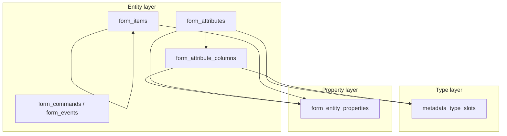

# Form entity model (specification)

**Status:** implemented (`INDEXER_VERSION` 12)  
**Related:** [`form-type-system.md`](form-type-system.md) (types), [`dependency-layer.md`](dependency-layer.md) (metadata layering), [`database.md`](database.md) (SQLite), [`mcp-tools.md`](mcp-tools.md) (tools)  
**Origin:** MCP feedback — `get_form_structure` truncates DynamicList `QueryText`; broader gaps in form property handling

When implemented, bump **`INDEXER_VERSION`** to **12** and rebuild databases via `admin_tool` (see [`database.md`](database.md)).

---

## 1. Problem statement

### 1.1 Immediate symptom

- Full `QueryText` is parsed and stored in `form_attributes.query_text`.
- MCP text output truncates to 100 chars (`server/dispatch/forms.py`).
- `search_code` indexes module code only, not form query text.

### 1.2 Structural gaps

- Form **properties** are ad hoc: some in DB columns, some parsed and discarded, some never parsed; conditional appearance stored as a raw XML blob.
- **Overview** and **detail** are not separated: overview either omits data or leaks/truncates large values.
- UI item overview uses **one fixed field set for all element types** — not type-relevant bindings.
- No drill-down tools for attribute or item detail.

---

## 2. Architectural principles

| # | Principle |
|---|-----------|
| P1 | Forms follow the same layering as metadata: **Entity → Types → Properties** |
| P2 | **Types** live only in `metadata_type_slots` (resolved `types[]`); never as strings in EAV or overview |
| P3 | **Properties** live in one EAV table (`form_entity_properties`); no proliferating JSON/per-property columns |
| P4 | **Child entities** stay child entities (`form_attribute_columns`, `form_items` tree) — not flattened into parent EAV |
| P5 | **No raw XML** to agents (storage or response); structured property paths + values only |
| P6 | **Overview vs drill-down**: overview shows type-relevant key properties; full property set on demand |
| P7 | **One denormalization writer**: parser flattener is the single source; optional denormalized columns copied in the same pass |
| P8 | **Column encapsulation**: columns are not listed in the whole-form overview; agent drills into the parent table/list/tree, then into a column via the **same** tool with `column_name` |

---

## 3. Layer model



`entity_kind` in EAV: `attribute` | `attribute_column` | `item` (see §3.3).

### 3.1 Entity layer (identity + hierarchy)

| Entity | Table | Parent | Notes |
|--------|-------|--------|-------|
| Form attribute | `form_attributes` | `forms` | `name`, `title`, `is_main` |
| Attribute column | `form_attribute_columns` | `form_attributes` | ValueTable / AdditionalColumns; own row IDs for type slots |
| UI item | `form_items` | `form_items` via `parent_id` | `name`, `item_type` (target; see §3.4) |
| Form command | `form_commands` | `forms` | overview-sufficient for now |
| Form / item events | `form_events`, `form_item_events` | — | normalized; canonical for drill-down in v1 |
| Functional options | `fo_form_usage` | — | linkage, not properties |

Do **not** merge `form_attribute_columns` into `form_attributes` — child rows exist for `metadata_type_slots` and `find_referencing_objects` (`via: form_attribute_column`). See [`form-type-system.md`](form-type-system.md).

Do **not** flatten `<Columns>` into parent attribute EAV.

**Functional options on columns:** index via `fo_form_usage` with `element_type='FormAttributeColumn'`, `element_name=<column name>` (parent attribute disambiguated by tool parameters). Parser must extract `FunctionalOptions` from `<Column>` nodes.

### 3.2 Column encapsulation (tables, lists, trees)

Columns exist in **two planes** — same rules for both:

| Plane | Column container | Column entity | Indexed as |
|-------|------------------|---------------|------------|
| **Data** (реквизит) | `ValueTable`, `DynamicList` (Settings fields) | `form_attribute_columns` or `Settings.Field` | `attribute_column` EAV / field rows on parent attribute |
| **UI** (элемент) | `Table`, `TreeField` (when added to parser whitelist) | Child `form_items` under container | `item` EAV per child |

**Whole-form overview (`get_form_structure`) — columns hidden:**

- **UI:** do not render `form_items` whose ancestor is a **column container** (`Table`, future `TreeField`). Show the container only, with a hint: `columns: N — get_form_item(element_name="…")`.
- **Data:** do not list `form_attribute_columns` rows or DynamicList `Field` entries. For `ValueTable` / `DynamicList`, show wrapper `types[]` and hints only, e.g. `columns: 12 — get_form_attribute(attribute_name="…")` or `QueryText: present (N chars)`.

**Drill-down — same tool, two levels:**

| Tool | Parent only | Parent + `column_name` |
|------|-------------|-------------------------|
| `get_form_item` | Container props + **column index** (child UI items: name, type, compact profile) | Full props + events for that child item |
| `get_form_attribute` | Attribute props + **column index** (name, `types[]`, `table` for ValueTable; key + dataPath for DynamicList fields) | Full props for `form_attribute_columns` row (`attribute_column` EAV, `types[]`, FO) or selected DynamicList field |

`column_name` is optional on both tools. No separate `get_form_attribute_column` tool.

`find_form_element` may still locate a column field by `data_path` (search use case); it returns overview-profile fields only, not a substitute for parent drill-down.

### 3.3 Type layer

- Unchanged: `shared/metadata_type_resolver.py`, `source_table` ∈ `form_attributes` | `form_attribute_columns`.
- Flattener **skips** all `<Type>`, Settings type descriptions, and `<Columns>`.

### 3.4 Property layer (EAV)

```sql
CREATE TABLE form_entity_properties (
    id INTEGER PRIMARY KEY AUTOINCREMENT,
    entity_kind TEXT NOT NULL,       -- 'attribute' | 'attribute_column' | 'item'
    entity_id INTEGER NOT NULL,      -- form_attributes.id | form_attribute_columns.id | form_items.id
    property_path TEXT NOT NULL,     -- e.g. Height, Settings.QueryText
    property_name TEXT NOT NULL,     -- leaf tag name
    ordinal INTEGER NOT NULL DEFAULT 0,
    value_text TEXT,
    value_type TEXT,                 -- boolean | string | number | longtext | ref
    UNIQUE(entity_kind, entity_id, property_path, ordinal)
);

CREATE INDEX ix_fep_entity ON form_entity_properties(entity_kind, entity_id);
CREATE INDEX ix_fep_path ON form_entity_properties(property_path);
CREATE INDEX ix_fep_name ON form_entity_properties(property_name);
```

**Flattener rules** (`shared/xml_parser/forms.py`):

- Walk the XML subtree of each **attribute**, **attribute column** (`<Column>`), and **UI item** element.
- **Skip on attribute:** `Type`, `Columns` (child entities flattened separately).
- **Skip on column (`<Column>`):** `Type` only.
- **Skip on UI item:** `ChildItems`, `Items` (child items are separate entities).
- Repeated siblings → increment `ordinal` per sibling group.
- Strip namespace prefixes in paths (`dcssch:dataPath` → `dataPath` under parent).
- `value_type=longtext` for `QueryText` and similar large text.

**Repeated nodes (decided):** store `ordinal` in DB; render paths in agent text with bracket notation, e.g. `Settings.Field[0].dataPath`.

**Denormalization (decided):** keep `form_attributes.query_text` populated from `Settings.QueryText` in the **same parse pass** as EAV — search index and overview hints only; EAV is authoritative on conflict.

### 3.5 Dual storage rules (target state)

| Data | Authoritative store | Overview source |
|------|---------------------|-----------------|
| Item identity | `form_items`: `name`, `item_type`, `parent_id` | always (except column children in structure tree — §3.2) |
| Item properties | `form_entity_properties` (`entity_kind=item`) | profile-filtered EAV |
| Attribute identity | `form_attributes`: `name`, `title`, `is_main` | always |
| Attribute properties | `form_entity_properties` (`entity_kind=attribute`) | attribute overview profiles |
| Column identity | `form_attribute_columns`: `name`, `title`, `table_context` | column index on parent drill only |
| Column properties | `form_entity_properties` (`entity_kind=attribute_column`) | column drill with `column_name` |
| Types | `metadata_type_slots` | `types[]` |
| Column FO | `fo_form_usage` (`FormAttributeColumn`) | column drill with `column_name` |
| Item events | `form_item_events` | `get_form_item` only |

**Retire** legacy `form_items` columns (`data_path`, `title`, `visible`, `enabled`, `command_name`) after EAV + profiles ship; until then, flattener is the single writer and copies into both EAV and legacy columns in one pass.

---

## 4. Overview property profiles

**Current state:** all UI items share the same hard-coded overview fields via `form_items` columns and one dispatch template.

**Target:** hard-coded **key property paths per element type** (or family). Overview tools read from EAV filtered by profile.

**Invariant (implementation):** parser `item_types_set` ⊆ types with a defined profile (test or `project-doctor` check).

### 4.1 Families

| Family | Item types | Rationale |
|--------|------------|-----------|
| `field_like` | `InputField`, `LabelField`, `CheckBoxField`, `RadioButtonField` | Data-bound field; validated on АРМ `InputField`, Планета `LabelField` |
| `list_like` | `Table` | List/table UI container; validated on Планета `ФормаСписка` `Table` |
| `column_container` | `Table` (+ `TreeField` when indexed) | Hides all descendant items from `get_form_structure`; columns on parent drill |
| `command_like` | `Button` | Command binding; validated on Планета `Button` + `CommandName` |
| `container` | `UsualGroup`, `Pages`, `Page`, `ButtonGroup`, `Popup`, `CommandBar` | Layout; validated on АРМ `UsualGroup`, Планировщик `Page` |
| `decoration` | `LabelDecoration`, `PictureDecoration`, `ExtendedTooltip` | Non-data decorative |
| `document_field` | `SpreadSheetDocumentField`, `HTMLDocumentField`, `FormattedDocumentField` | Document viewers |
| `chart_like` | `FlowchartField`, `PlannerField`, `GanttChartField` | Complex bound controls; validated on ТД `PlannerField` |
| `search_control` | `SearchControl` | Search UI |

### 4.2 UI item overview profiles (property_path lists)

Always show in overview: `name`, `item_type`, tree `depth`.

| Family / type | Overview `property_path`s |
|---------------|---------------------------|
| **field_like** | `DataPath`, `Title`, `Visible`, `Enabled`, `ReadOnly` |
| **list_like** (`Table`) | `DataPath`, `Title`, `Visible`, `Enabled`, `RowPictureDataPath`, `AutoRefresh` + `columns: N` hint |
| **command_like** (`Button`) | `CommandName`, `Title`, `Visible`, `Enabled`, `Representation` |
| **container** | `Title`, `Visible`, `Enabled`, `Group`, `Representation` |
| **decoration** | `Title`, `Visible`, `Enabled` |
| **document_field** | `DataPath`, `Title`, `Visible`, `Enabled` |
| **chart_like** | `DataPath`, `Title`, `Visible`, `Enabled` |
| **search_control** | `DataPath`, `Title`, `Visible`, `Enabled` |

**Per-type mapping** (when family is not enough):

| `item_type` | Family |
|-------------|--------|
| `InputField` | `field_like` |
| `LabelField` | `field_like` |
| `CheckBoxField` | `field_like` |
| `RadioButtonField` | `field_like` |
| `Table` | `list_like` |
| `Button` | `command_like` |
| `UsualGroup` | `container` |
| `Pages` | `container` |
| `Page` | `container` |
| `ButtonGroup` | `container` |
| `Popup` | `container` |
| `CommandBar` | `container` |
| `LabelDecoration` | `decoration` |
| `PictureDecoration` | `decoration` |
| `ExtendedTooltip` | `decoration` |
| `SpreadSheetDocumentField` | `document_field` |
| `HTMLDocumentField` | `document_field` |
| `FormattedDocumentField` | `document_field` |
| `FlowchartField` | `chart_like` |
| `PlannerField` | `chart_like` |
| `GanttChartField` | `chart_like` |
| `SearchControl` | `search_control` |

**Overview output rules:**

- Show only properties listed in the profile for that `item_type`.
- **Do not** list child items of `column_container` types in the structure tree (§3.2).
- `CommandName` → `command_source` + text suffix (existing `_resolve_command_source` / `_form_item_command_suffix`).
- Do not show properties outside the profile — agent calls `get_form_item`.
- Append hint: `get_form_item(element_name="…")` for columns and full properties.
- When `DataPath` equals a form attribute `name`, optional suffix: `(→ attribute {name})`.

**Column child UI items** (inside Table / tree): use **`field_like`** profile when listed on parent drill index; full detail via `get_form_item(element_name=<parent>, column_name=<child>)`.

### 4.3 Attribute overview profiles

| Wrapper / shape | Overview fields |
|-----------------|-----------------|
| All attributes | `name`, `is_main`, `title` (if set), `types[]` |
| `ValueTable` | `types[]` + `columns: N — get_form_attribute(attribute_name="…")` hint — **no column list** |
| `DynamicList` | `types[]` + `QueryText: present (N chars)` hint + `columns: N` (Settings.Field count) hint — **no field list** |
| `ValueListType` | `types[]` (includes inner from Settings) |
| `DocumentObject.*` / other | `types[]` + title |

Large attribute properties (full `QueryText`, Settings flags, `UseAlways`, field definitions, …) → **`get_form_attribute`** (parent or with `column_name`).

### 4.4 Attribute column overview profile (parent drill index + column drill)

Applies to `form_attribute_columns` (`entity_kind=attribute_column`).

| Context | Fields |
|---------|--------|
| **Column index** on `get_form_attribute` (no `column_name`) | `name`, `types[]`, `table` (AdditionalColumns) |
| **Column drill** (`column_name` set) | index fields + EAV properties (`Title`, `FillChecking`, …) + `functional_options` |

DynamicList **field** rows (not separate DB entities): indexed on parent drill by `dataPath` / field key; full field props from parent-attribute EAV when `column_name` selects a field.

**DynamicList `Field` storage (decided):** EAV on parent attribute with `ordinal`; `column_name` matches `Settings.Field` `dataPath` when present, else `field` text. Child-entity table reserved for [`form-dynamiclist-settings`](todo.md) if MainTable/DCS need first-class typing.

---

## 5. MCP tool contract

### 5.1 Overview

| Tool | Role |
|------|------|
| `get_form_structure` | Form map: attribute profiles + item tree with type-filtered overview properties; commands; form events; drill-down hints |
| `find_form` | Discover forms |
| `find_form_element` | Find by `element_name` / `data_path`; overview-profile fields only |

### 5.2 Drill-down

| Tool | Parameters | Role |
|------|------------|------|
| `get_form_attribute` | `attribute_name`; optional `column_name` | Without `column_name`: attribute EAV + `types[]` + column index. With `column_name`: column detail (`attribute_column` EAV, `types[]`, FO) or DynamicList field slice |
| `get_form_item` | `element_name`; optional `column_name` | Without `column_name`: item EAV + events + column index for containers. With `column_name`: child UI item under that parent |

No specialized tools (e.g. `get_dynamic_list_query`, `get_form_attribute_column`).

**`get_functional_options`:** extend `element_type` with `FormAttributeColumn`; requires `attribute_name` + `column_name` to identify the column on a form.

### 5.3 Search

| Tool | Role |
|------|------|
| `search_code` | Extend: search `QueryText` via denormalized `form_attributes.query_text`; hint → `get_form_attribute` |
| `search_form_properties` | **Future:** generalize to EAV `property_path` + `value_text` (supersedes Visible/Enabled-only) |

### 5.4 Agent workflow

```
get_form_structure → type-relevant overview (no column children in UI tree; no column lists on attributes)
  → get_form_item(element_name=<Table>) / get_form_attribute(attribute_name=<list>)
       → column index
  → same tool + column_name=<col> for column detail
  → search_code (query fragment) → get_form_attribute(attribute_name=…)
```

---

## 6. Events and out-of-scope patterns

| Concern | v1 decision |
|---------|-------------|
| Item / form events | Keep `form_item_events` / `form_events`; expose in `get_form_item` / structure overview for form events — **not** duplicated in EAV |
| Conditional appearance | Stays `form_conditional_appearance.xml_data` until a separate spec |
| Commands | `form_commands` table; overview-sufficient |

---

## 7. Current vs target

| Concern | Current | Target |
|---------|---------|--------|
| Item overview props | Same columns for all types | Profile per `item_type` / family |
| Table column UI items | All shown in structure tree | Hidden; parent drill + `column_name` |
| ValueTable / DynamicList columns | Listed in attribute overview | Count hint only; parent drill + `column_name` |
| Attribute QueryText | Truncated in overview | Hint only; full in `get_form_attribute` |
| Column props (title, validation, FO) | Not indexed | `attribute_column` EAV + `FormAttributeColumn` FO |
| Property storage | Scattered / dropped | EAV |
| Types | `metadata_type_slots` | unchanged |
| ValueTable columns | `form_attribute_columns` | unchanged (child entities) |
| Raw XML to agent | N/A | rejected |

---

## 8. Implementation checklist (when coding starts)

1. Bump `INDEXER_VERSION` to **12**; add `form_entity_properties` DDL and insert in `admin_tool/db_manager/`.
2. Implement XML flattener for `attribute`, `attribute_column`, `item`; wire into form insert.
3. Parse `FunctionalOptions` on `<Column>`; insert `fo_form_usage` as `FormAttributeColumn`.
4. Add `shared/form_overview_profiles.py` mirroring §4 (single source for code + doc parity).
5. Implement `get_form_attribute`, `get_form_item` (with optional `column_name`); slim `get_form_structure` (suppress column children, column list hints).
6. Extend `search_code` for `query_text`; extend `get_functional_options` for `FormAttributeColumn`.
7. Retire redundant extractors after EAV ships.
8. Tests: column encapsulation on Планета `ФормаСписка`, ValueTable columns on ТД АРМ, `column_name` drill.
9. `CHANGELOG.md` entry when shipped.

---

## 9. Rejected approaches

- Raw XML blob as agent payload
- Specialized per-property MCP tools
- Fake `modules` rows for query text
- Merging `form_attribute_columns` into parent attribute
- Flattening ValueTable columns into parent EAV ordinals
- Per-entity JSON property columns
- Always-full QueryText in `get_form_structure`

---

## 10. Reference scenario (specified behavior)

```
get_form_structure("НастраиваемыйОтчет", "ФормаСписка", project_filter="Планета")

Attributes:
  • Список [Основной]: DynamicList
    QueryText: present (2847 chars); columns: 42
    — get_form_attribute(attribute_name="Список")

Items:
  • Список (Table) -> Список  RowPictureDataPath=…  columns: 18
    — get_form_item(element_name="Список")
  (no ВидОтчета / Организация / … rows in structure tree)

get_form_item(..., element_name="Список")
  … Table properties …
  Columns:
    • ВидОтчета (LabelField) -> Список.ВидОтчета
    • Организация (LabelField) -> Список.Организация
    …

get_form_item(..., element_name="Список", column_name="ВидОтчета")
  DataPath: Список.ВидОтчета
  Title: …
  … full EAV …

get_form_attribute(..., attribute_name="Список")
  Settings.QueryText: <full query>
  Columns (fields):
    • dataPath=Ссылка field=Ссылка
    …

get_form_attribute(..., attribute_name="Список", column_name="Ссылка")
  Settings.Field[0].dataPath: Ссылка
  …
```

**ValueTable example** (ТД АРМ, attribute `График`):

```
get_form_structure → График: ValueTable  columns: 64 — get_form_attribute(attribute_name="График")

get_form_attribute(..., attribute_name="График", column_name="Заявка")
  name: Заявка
  types: DocumentRef.ТД_ЗаявкаНаПродажу
  Title: Заявка
  FillChecking: …
  functional_options: …
```

**Validation exports:**

| Export | Form.xml | Validates |
|--------|----------|-----------|
| Планета / ERP Кашпур | `Documents/НастраиваемыйОтчет/Forms/ФормаСписка` | DynamicList + `Table` list_like profile |
| ТД_ОперативныйУчет | `DataProcessors/ФТ_АРМДиспетчера/Forms/Форма` | ValueTable columns, `field_like`, `container` |
| ТД_ОперативныйУчет | `InformationRegisters/ТД_ГрафикиДоставок/Forms/Планировщик` | `PlannerField` chart_like, ValueListType |

---

## 11. History

| Date | Event |
|------|-------|
| 2026-07-10 | Specification formalized from MCP feedback thread and architecture review |
| 2026-07-10 | Column encapsulation: hidden in structure overview; parent + `column_name` drill on same tools; `attribute_column` EAV and `FormAttributeColumn` FO |
