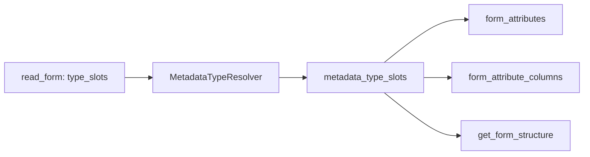

## Type system для реквизитов форм

**Статус:** **реализовано** (`INDEXER_VERSION` 9 — type system форм). Текущий формат индекса — **10** (фаза 3: подсистемы в `metadata_relations`, отдельный bump). DynamicList Settings (MainTable, СКД) — см. `form-dynamiclist-settings` в [`todo.md`](todo.md).

Связанные документы: [`dependency-layer.md`](dependency-layer.md), [`architecture.md`](architecture.md), [`database.md`](database.md), [`mcp-tools.md`](mcp-tools.md), [`form-entity-model.md`](form-entity-model.md) (properties / overview / drill-down — **spec**, not yet implemented), [`testing-protocol.md`](testing-protocol.md).

---

### Контекст

Фаза 1 type system закрыла только реквизиты **метаданных** (`attributes`, `tabular_section_columns`). Формы — отдельный XML (`logform`), другие паттерны типов (`ValueListType`, `ValueTable`, `DynamicList`, Settings/TypeDescription). До v9 типы форм хранились строкой в `form_attributes.type` и теряли составные типы и колонки ValueTable — см. CHANGELOG 2026-06-14.

**Цель (достигнута):** те же слоты `metadata_type_slots`, resolved `types[]` в `get_form_structure`, как у metadata.

---

### Реализация

> **Обновление 2026-07-19:** слоты типов форм больше не извлекаются парсером C-MCP —
> их отдаёт единый движок (`onec_metadata_schema.read_form`, резолвер `parse_cfg_type_string`),
> `_parse_form_via_library` пробрасывает `type_slots` без изменений. Старые logform-хелперы
> (`_extract_logform_type_slots`/`_extract_columns`) удалены вместе с legacy-путём форм
> (см. CHANGELOG 2026-07-19). Ниже — исходная схема фазы 1; поведение слотов/резолвера то же.



| Компонент | Файл | Поведение |
|-----------|------|-----------|
| Парсер | движок `onec_metadata_schema.read_form` → `_parse_form_via_library` (`shared/xml_parser/forms.py`) | `type_slots` у реквизитов и колонок (Column + AdditionalColumns) приходят из движка |
| Resolver | `shared/metadata_type_resolver.py` | wrappers (`ValueListType`, `ValueTable`, `DynamicList`) + inner из Settings |
| БД | `admin_tool/db_manager.py` | `form_attribute_columns`; слоты после insert форм |
| MCP | `server/tools.py` — `get_form_structure` | `types[]` у attributes и columns; `table` для AdditionalColumns |

`metadata_type_slots.source_table`: `'form_attributes'` | `'form_attribute_columns'`. Колонок `form_attributes.type` и `columns_json` **нет**.

---

### Решения (2026-06-14)

1. **Wrappers:** wrapper + inner (`TypeDescriptor` для `ValueListType`, `ValueTable`, `DynamicList` + inner slots из Settings).
2. **Колонки:** таблица `form_attribute_columns` + слоты.
3. **DynamicList Settings:** вне v1 — `form-dynamiclist-settings` в todo.
4. **`find_referencing_objects` по формам:** **готово** (фаза 2 dependency-layer).
5. **DefinedType (`INDEXER_VERSION` 16):** объект whitelist в `metadata_objects`; `cfg:DefinedType.X` → слот на объект DefinedType; состав типа — слоты на самом DefinedType (`source_table='metadata_objects'`). Adopted DefinedType в расширении без `<Type>` может иметь пустой состав.
6. **AnyRef / безымянный TypeSet:** slot не материализуется; `format_types_for_text` показывает `(тип не определён)`.
7. **Произвольный `prefix:Name` без точки (P-3, `INDEXER_VERSION` 15):** любой bare платформенный тип — не только старый whitelist `v8:ValueListType`/`v8:ValueTable` — материализуется как `TypeDescriptor` по имени (`pl:Planner` → `Planner`, `dcsset:SettingsComposer` → `SettingsComposer`, `mxl:SpreadsheetDocument` → `SpreadsheetDocument`, …). Раньше 32% реквизитов форм в Планете (`44 147` из `137 638`) оставались без резолвленного типа именно из-за этого — см. `CHANGELOG.md` (2026-07-10, P-3).

---

### Form-specific типы

| XML / cfg | Смысл в 1С | Примечание |
|-----------|------------|------------|
| `v8:ValueListType` + Settings | СписокЗначений | wrapper + inner |
| `v8:ValueTable` | ТаблицаЗначений | wrapper + колонки в `form_attribute_columns` |
| `cfg:DynamicList` | ДинамическийСписок | wrapper + `Settings.QueryText` в EAV; MainTable — backlog |
| `cfg:DocumentObject.X` | Объект документа на форме | resolve через `object_type_hint` → Document |
| `pl:Planner` и др. bare `prefix:Name` | Спец. UI-тип (Planner, SettingsComposer, SpreadsheetDocument, Color, Font, UUID, …) | `kind: primitive`, `base_type=Name` — материализуется как `TypeDescriptor` (P-3, `INDEXER_VERSION` 15; раньше `kind: unknown`, не материализовался) |

---

### Эталонные выгрузки (вне репозитория)

Источник истины — реальные `Form.xml` ([`testing-protocol.md`](testing-protocol.md)).

| Выгрузка | Путь |
|----------|------|
| Опер учет | `C:\Users\Alex\Documents\Работа\Общая\Опер учет` |
| Расш бюдж | `C:\Users\Alex\Documents\Работа\Общая\Выгрузка конф\Расш бюдж` |

| Form.xml | Проверка |
|----------|----------|
| `DataProcessors/ФТ_АРМДиспетчера/Forms/Форма/Ext/Form.xml` | ValueTable + Column; составной DocumentRef; ValueListType; DynamicList |
| `InformationRegisters/ТД_ГрафикиДоставок/Forms/Планировщик/Ext/Form.xml` | ValueListType + Settings; `pl:Planner`; DynamicList |
| АРМ, реквизиты DocumentObject | AdditionalColumns с `table` |

MCP-проверка: проект **Трансгаз**, база **ТД_ОперативныйУчет** (v9).

---

### MCP: `get_form_structure`

```json
{
  "name": "СписокТС",
  "types": [
    { "kind": "primitive", "base_type": "ValueListType" },
    { "kind": "object", "object_type": "Catalog", "name": "ТранспортныеСредства", "synonym": "…" }
  ],
  "columns": [
    {
      "name": "Заявка",
      "types": [{ "kind": "object", "object_type": "Document", "name": "ТД_ЗаявкаНаПродажу" }]
    }
  ]
}
```

Текстовый ответ — `format_types_for_text` в [`shared/metadata_type_resolver.py`](../shared/metadata_type_resolver.py).

**После реализации [`form-entity-model.md`](form-entity-model.md):** массив `columns` в **`get_form_structure` убирается** — только `columns: N` и подсказка `get_form_attribute(attribute_name=…)`; полный `types[]` колонки — на drill-down с `column_name`.

---

### Вне scope (backlog)

- `form_items.item_type` (UI, не data type) — overview profiles per type: [`form-entity-model.md`](form-entity-model.md) §4.
- Settings DynamicList (MainTable, СКД) — `form-dynamiclist-settings`; interim: EAV on attribute per [`form-entity-model.md`](form-entity-model.md).
- `find_referencing_objects` по слотам форм — **готово** (фаза 2).
- Условное оформление форм.

---

### Критерии готовности (выполнены)

1. `get_form_structure` → **`types[]`**, без `form_attributes.type`.
2. **Планировщик / `СписокТС`:** `Catalog.ТранспортныеСредства` из Settings.
3. **АРМ / `График`:** колонки не пустые; `ДокументОтгрузки` — оба DocumentRef.
4. AdditionalColumns с `table` в ответе.
5. `list_objects` / `find_object` не показывают `TypeDescriptor`.
6. Unit-тесты: `tests/test_xml_parser_logform_type.py`, `tests/test_metadata_type_resolver.py`.

---

### История

| Дата | Событие |
|------|---------|
| 2026-06-14 | ТЗ; реализация; `INDEXER_VERSION` 9 |
